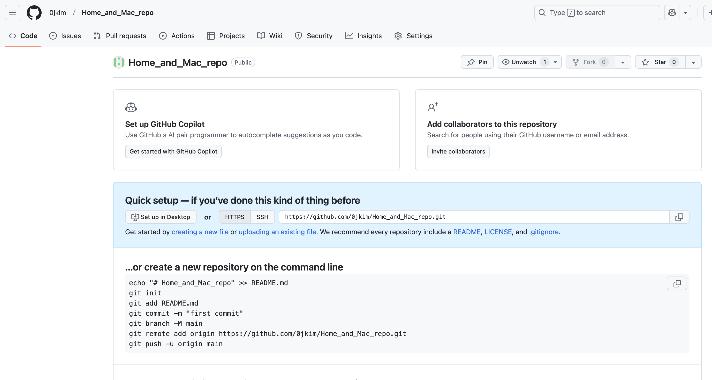
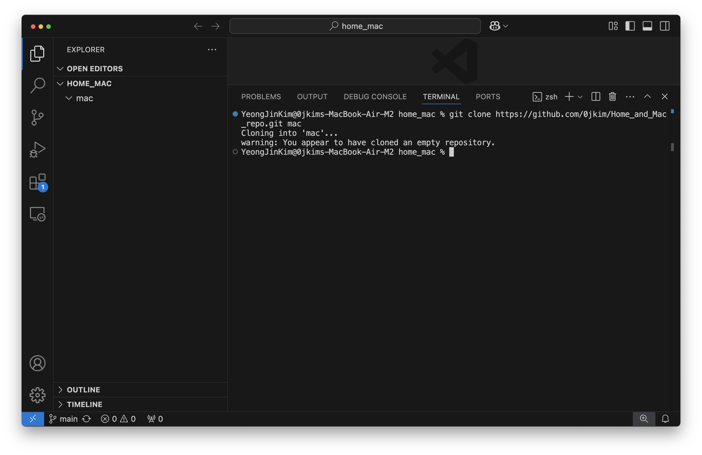
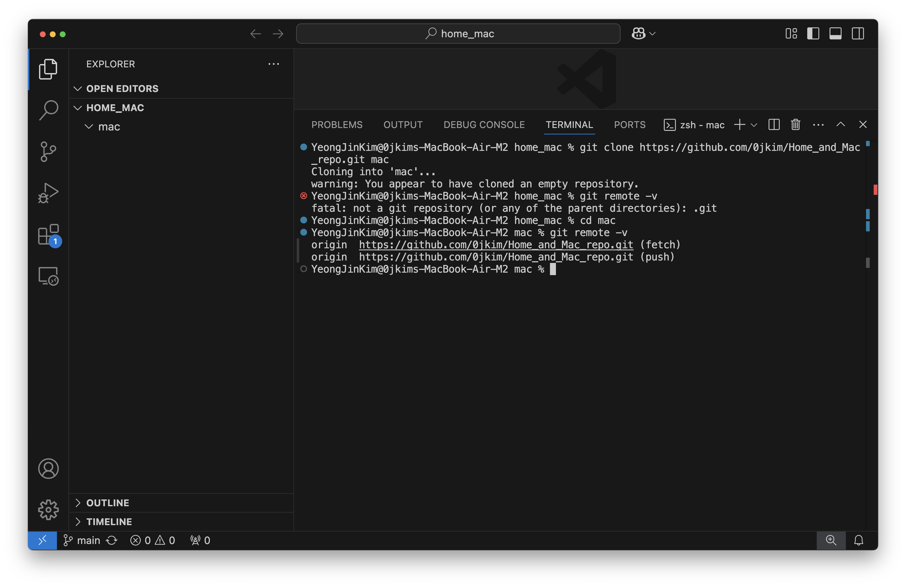
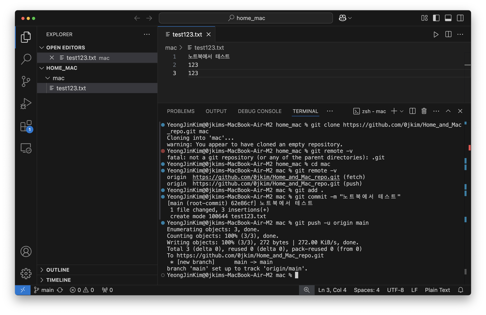
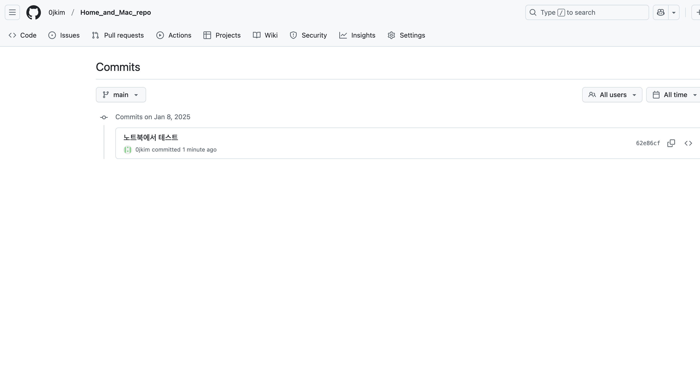
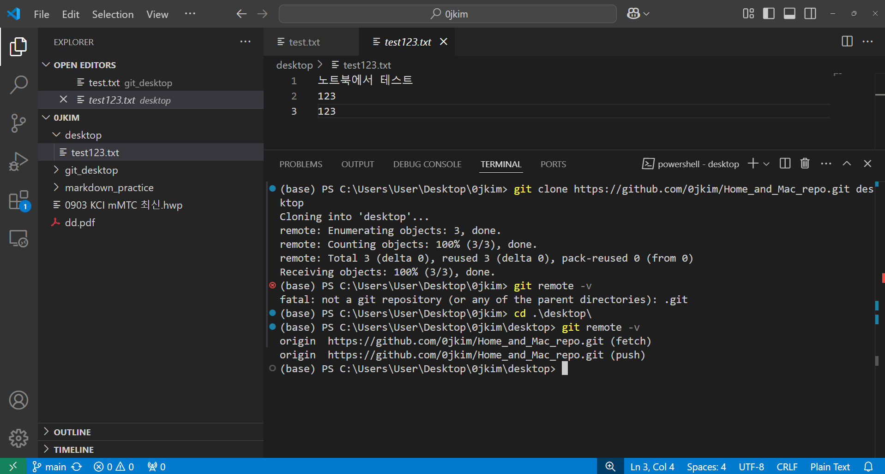
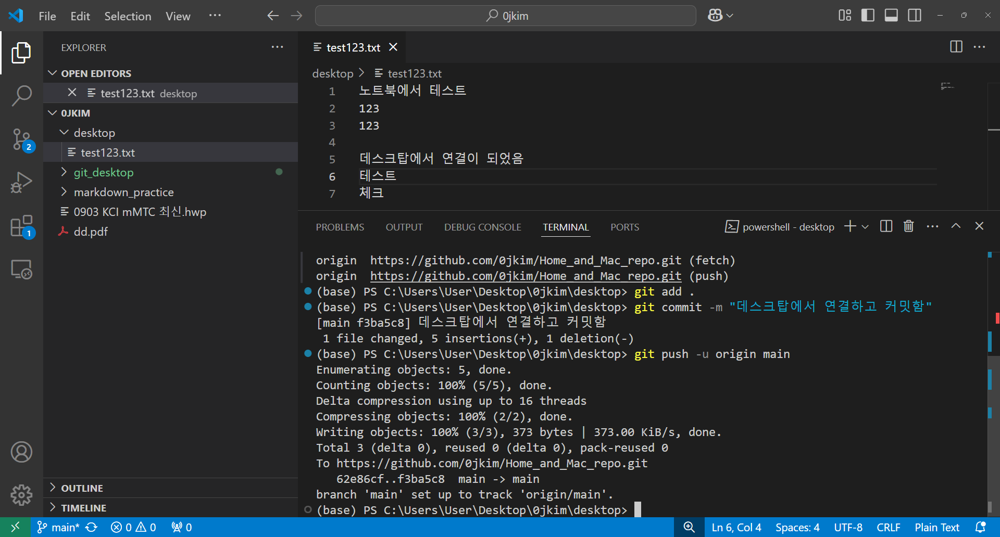
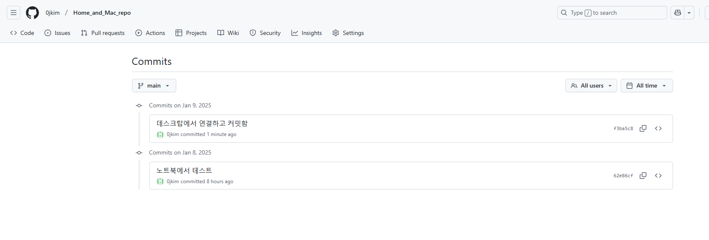

# 여러 PC에서 같은 repository를 공유해서 작업하기
`git`으로 코드 상태를 확인하면서 작업할 때 유용하게 사용하고 있다.  

집에서는 주로 PC, 밖에서는 노트북으로 작업을 하고 있는데,  

같은 폴더를 공유해서 사용하려면 클라우드에 코드를 올려서 그걸 다운받아서 사용해야한다.  

이게 여간 귀찮은 작업이 아닐 수가 없다.  

그래서 여러 PC에서 같은 repository를 공유하면 나의 경우 PC와 노트북의 작업 상태를 동기화 할 수 있다.  

## 1. 환경 세팅
우선, 원격 저장소를 하나 만들어 준다.  



이제 이 원격 저장소에 `git clone <저장소 url>`을 입력하면 원격 저장소에 있던 파일을 불러옴과 동시에 원격 저장소와 remote 된 상태가 된다.  

이때, `git clone <저장소 url> <폴더 이름>`을 입력하면 원격 저장소에 있던 파일을 만들려는 폴더 이름을 생성하고 그곳에 clone(복제)하게 된다.  

### 1.1 노트북 환경 세팅
자 소개했던 명령어로 노트북 환경 세팅을 해보자.  

```
git clone <저장소 URL> <폴더 이름>
```



이제 새로 만든 폴더는 원격 저장소에 연결이 되었을 것이다.  

```
cd <새로 만든 폴더 이름>

git remote -v
```


잘 연결이 되었으니 파일을 하나 만들고 push 테스트를 해보자.  



원격 저장소(github repository)를 확인해보면 push가 잘 되었고 커밋 기록이 잘 남아있다.  



### 1.2 데스크톱 환경 세팅
우리가 원하는 것은 노트북 환경과 데스크탑 환경을 동기화 해주어야 한다.  

예를 들어, 회사에서 작업한 내용을 집에서도 계속 이어서 하고 싶다면, 원격(ssh, tunnel 등)을 이용해도 되지만 여기서는 git 레파지토리를 공유하여 작업하기를 원하는 것이다.  

따라서 pc에서도 작업할 레파지토리를 `clone`한 뒤, 폴더 하나를 만들어서 작업을 이어 나가면 된다.  



이렇게 새로 만들어진 desktop 폴더는 원격 저장소 내용을 복제함과 동시에 remote 된다.  

push 해보고 확인해보자.  






따라서 데스크탑에서 작업(add, commit, push)을 이어가고 나중에 노트북에서 작업을 이어서 하고 싶을때 `git pull`만 수행해주면 된다.  

`git pull`을 하지 않으면 원격 저장소 내용과 로컬 저장소가 일치하지 않아서 에러가 발생하기 때문이다.  


